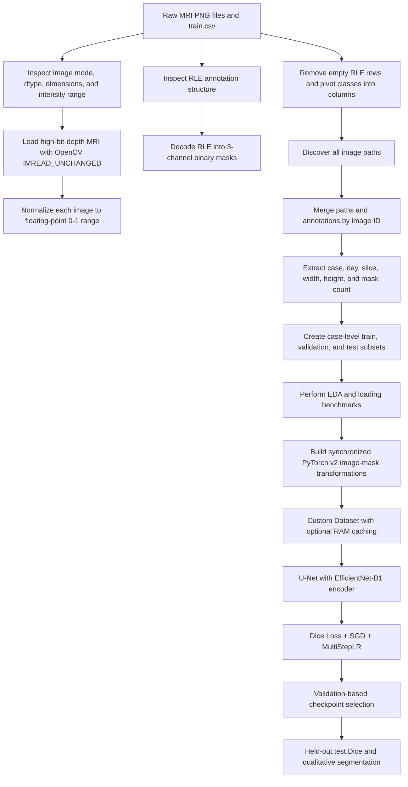

# MRI Image Segmentation

**Author:** Shayan Rokhva

**Includes: study of Kaggle gastrointestinal MRI data: image inspection, RLE mask reconstruction, case-level splitting, synchronized image–mask augmentation, memory-aware loading, transfer learning, training diagnostics, and segmentation evaluation**

---

## Table of Contents

1. [Project Overview](#project-overview)
2. [What This Project Covers](#what-this-project-covers)
3. [Problem Definition](#problem-definition)
4. [Dataset and Annotation Structure](#dataset-and-annotation-structure)
5. [End-to-End Workflow](#end-to-end-workflow)
6. [Understanding the Raw MRI Images](#understanding-the-raw-mri-images)
7. [Understanding and Decoding RLE Masks](#understanding-and-decoding-rle-masks)
8. [DataFrame Reconstruction and Data Cleaning](#dataframe-reconstruction-and-data-cleaning)
9. [Duplicate-Mask Investigation and Leakage Awareness](#duplicate-mask-investigation-and-leakage-awareness)
10. [Feature Engineering](#feature-engineering)
11. [Case-Level Train, Validation, and Test Splits](#case-level-train-validation-and-test-splits)
12. [Exploratory Data Analysis](#exploratory-data-analysis)
13. [Image and Mask Transformations](#image-and-mask-transformations)
14. [Custom PyTorch Dataset](#custom-pytorch-dataset)
15. [Memory Caching and DataLoader Engineering](#memory-caching-and-dataloader-engineering)
16. [Model Architecture](#model-architecture)
17. [Loss Function and Evaluation Metric](#loss-function-and-evaluation-metric)
18. [Training and Evaluation Logic](#training-and-evaluation-logic)
19. [Training Diagnostics and Hyperparameter Exploration](#training-diagnostics-and-hyperparameter-exploration)
20. [Final Training Configuration](#final-training-configuration)
21. [Training Results](#training-results)
22. [Held-Out Test Performance](#held-out-test-performance)
23. [Qualitative Segmentation Results](#qualitative-segmentation-results)
24. [Interpretation of Model Behavior](#interpretation-of-model-behavior)
25. [Reproducibility](#reproducibility)
26. [How to Run the Project](#how-to-run-the-project)
27. [Expected Repository and Data Structure](#expected-repository-and-data-structure)
28. [Methodological Scope and Current Limitations](#methodological-scope-and-current-limitations)
29. [Recommended Future Improvements](#recommended-future-improvements)
30. [Key Lessons from the Project](#key-lessons-from-the-project)
31. [Acknowledgements](#acknowledgements)

---

## Project Overview

This project develops a complete semantic-segmentation pipeline for identifying three gastrointestinal structures in abdominal MRI slices:

- **Large bowel**
- **Small bowel**
- **Stomach**

The work is based on the **UW-Madison gastrointestinal MRI segmentation data released through Kaggle**. The final segmentation model is a **U-Net with an ImageNet-pretrained EfficientNet-B1 encoder**, trained as a three-channel multilabel segmentation system.

The central objective was not merely to call a pretrained segmentation model and report a metric. A large part of the work was devoted to understanding how the data were stored, why the raw medical images initially appeared incorrectly, how the run-length encoded annotations should be reconstructed, how image identifiers map to files and patients, how to prevent image–mask misalignment during augmentation, and how to build a loading and training pipeline that is both computationally practical and methodologically defensible.

The final model achieved an overall **Dice score of 0.7938** on the held-out test subset used in the notebook.

> **Important evaluation scope:** the notebook removes empty annotation rows before pivoting the labels. Consequently, the downstream modeling dataset contains slices with at least one non-empty organ mask. The reported test Dice therefore describes performance on the held-out **annotated/positive-slice subset**, not on all original MRI slices including fully empty slices.

---

## What This Project Covers

The notebook implements and investigates the following stages:

- Inspection of raw MRI files, dimensions, data types, and intensity ranges
- Identification of the high-bit-depth image-loading problem
- Correct image loading with OpenCV using `IMREAD_UNCHANGED`
- Slice-wise intensity normalization
- Manual investigation of run-length encoding
- Reconstruction of three-channel binary segmentation masks
- Restructuring of annotation records with a pivot table
- Matching every annotation record to its corresponding image path
- Extraction of case, day, slice, width, height, and mask-count metadata
- Investigation of repeated RLE strings in neighboring MRI slices
- Case-level separation of training, validation, and test data
- Exploratory analysis of class occurrence, case size, and image resolution
- Comparison of separate PyTorch v1 transformations with synchronized PyTorch v2 transformations
- Construction of a custom `VisionDataset`
- Optional in-memory caching of MRI images
- DataLoader timing experiments
- U-Net construction with an EfficientNet-B1 encoder
- Dice-based multilabel optimization
- Sanity checking through untrained loss and small-subset overfitting
- Short learning-rate screening
- Scheduled 20-epoch training with checkpointing
- Held-out test evaluation
- Qualitative comparison of input, prediction, and ground truth
- Exploratory class-wise Dice and pixel-level statistics

The README explains all of these stages so that the project can be understood without reading the notebook line by line.

---

## Problem Definition

Let an abdominal MRI slice be represented by an image:

\[
X \in \mathbb{R}^{H \times W}
\]

The task is to predict three binary segmentation masks:

\[
Y \in \{0,1\}^{3 \times H \times W}
\]

where the three channels correspond to:

1. large bowel,
2. small bowel,
3. stomach.

This is treated as **multilabel semantic segmentation**, not ordinary multiclass classification. Each output channel is modeled independently because different organs may be present in the same slice at the same time.

The network produces three logit maps:

\[
\hat{Z} \in \mathbb{R}^{3 \times 224 \times 224}
\]

During inference, a sigmoid function converts the logits to probabilities:

\[
\hat{Y} = \sigma(\hat{Z})
\]

A threshold of 0.5 is used in the later pixel-statistics experiments when binary masks are required.

---

## Dataset and Annotation Structure

### Original annotation table

The raw `train.csv` contains three columns:

| Column | Meaning |
|---|---|
| `id` | Identifier of one MRI slice |
| `class` | One of `large_bowel`, `small_bowel`, or `stomach` |
| `segmentation` | Run-length encoded mask, or missing when the class is absent |

The original table contains:

| Quantity | Value |
|---|---:|
| Total CSV rows | 115,488 |
| Unique MRI slice identifiers | 38,496 |
| Classes per identifier | 3 |
| Non-empty RLE annotation rows | 33,913 |
| Unique non-empty RLE strings | 33,899 |

The equality

\[
38,496 \times 3 = 115,488
\]

confirms that each image identifier initially has one row for each of the three target classes.

### Image identifier format

An identifier such as:

```text
case133_day25_slice_0079
```

encodes:

- `case133`: the subject/case identifier,
- `day25`: the scan day,
- `slice_0079`: the slice number within the scan.

### Image filename format

A filename such as:

```text
slice_0053_266_266_1.50_1.50.png
```

contains:

- slice number,
- width,
- height,
- horizontal pixel spacing,
- vertical pixel spacing.

The notebook extracts image width and height. Pixel spacing is present in the filenames but is not used in the current model pipeline.

### Directory structure in the raw dataset

The MRI files follow a nested case/day structure:

```text
data/
├── train.csv
└── train/
    ├── case101/
    │   └── case101_day20/
    │       └── scans/
    │           ├── slice_0001_266_266_1.50_1.50.png
    │           ├── slice_0002_266_266_1.50_1.50.png
    │           └── ...
    ├── case102/
    └── ...
```

---

## End-to-End Workflow



---

## Understanding the Raw MRI Images

A substantial early part of the project is devoted to verifying the true numerical representation of the MRI data.

### Initial observation

A raw image opened with PIL was reported as:

```text
mode = I
size = 266 × 266
```

After conversion to a tensor, one example had:

```text
shape = [1, 266, 266]
dtype = int32
minimum = 0
maximum = 612
```

Another image contained intensities up to approximately **12,220**. These values immediately showed that the files were not ordinary 8-bit natural images restricted to the range 0–255.

### Why naive RGB conversion is unsafe

Converting a high-bit-depth MRI image directly to RGB can clip or remap information. A medical image with intensities considerably above 255 cannot be treated as a standard 8-bit photograph without checking how the conversion modifies its values.

The notebook therefore explicitly investigates the image type before committing to a loading strategy.

### Correct loading strategy

The final dataset class loads each image with:

```python
cv2.imread(path, cv2.IMREAD_UNCHANGED)
```

This preserves the original single-channel image and its high-bit-depth intensity values.

### Intensity normalization

Each image is scaled independently using min–max normalization:

\[
X' = \frac{X - \min(X)}{\max(X) - \min(X)}
\]

The normalized image is converted to `float32` and occupies the range `[0, 1]` before the later transformation pipeline maps it to approximately `[-1, 1]`.

This step solves two practical problems:

1. It makes the images visible and numerically suitable for neural-network training.
2. It prevents the model from receiving raw integer values whose scale varies strongly between slices.

A defensive min–max operation is also retained in the transformation pipeline. Since the custom loader already performs min–max scaling, this second operation mainly acts as a consistency check.

---

## Understanding and Decoding RLE Masks

The segmentation masks are stored with **run-length encoding (RLE)** rather than as separate mask images.

### RLE representation

An RLE string alternates between:

```text
start_position run_length start_position run_length ...
```

For example:

```text
47020 9 47378 12 47736 15 ...
```

means:

- begin at pixel 47,020 and mark 9 pixels,
- begin at pixel 47,378 and mark 12 pixels,
- begin at pixel 47,736 and mark 15 pixels,
- continue for all remaining pairs.

The annotation positions are one-based, so one is subtracted before using them as Python indices.

### Decoding process

For each of the three classes, the decoder:

1. Creates a flattened zero vector of length `height × width`.
2. Splits the RLE string into alternating starts and lengths.
3. Converts starts and lengths to integer arrays.
4. Changes starts from one-based to zero-based indexing.
5. Calculates each run end as `start + length`.
6. Assigns one to every encoded pixel interval.
7. Reshapes the flattened vector back to the original image dimensions.

The final mask has shape:

```text
[3, height, width]
```

The channels are ordered as:

| Channel | Class | Visualization color |
|---:|---|---|
| 0 | Large bowel | Red |
| 1 | Small bowel | Green |
| 2 | Stomach | Blue |

### Verifying mask alignment

The reconstructed masks are overlaid on their MRI slices to verify that the decoding, reshaping, and orientation are correct.


A later example displays multiple organ channels simultaneously:


This visual validation is essential. A decoder can produce a tensor with the correct dimensions while still being transposed, flipped, or reconstructed in the wrong memory order. Overlaying the mask on the anatomical image provides a direct sanity check.

---

## DataFrame Reconstruction and Data Cleaning

The original annotation table is not convenient for training because each image occupies three rows. The notebook transforms it into a one-row-per-image representation.

### Step 1: remove empty annotation rows

Rows with missing `segmentation` values are removed before pivoting:

```text
115,488 total rows → 33,913 non-empty annotation rows
```

This restricts the later dataset to slices containing at least one labeled target structure.

### Step 2: inspect repeated RLE strings

The notebook identifies annotation strings that occur more than once. A total of 28 rows are shown in the duplicate-RLE inspection, corresponding mainly to neighboring slices with equal masks.

These records are investigated rather than automatically deleted. Identical masks in adjacent MRI slices can be anatomically plausible, so equality of RLE strings alone is not sufficient evidence that a sample is erroneous.

### Step 3: pivot the classes into columns

The annotation table is pivoted from:

```text
id | class | segmentation
```

into:

```text
id | large_bowel | small_bowel | stomach
```

After pivoting, the dataset contains:

```text
16,590 image rows
```

Each row now represents one MRI slice and stores up to three RLE masks.

### Step 4: represent absent classes consistently

Missing values after pivoting are replaced with empty strings. When the saved subset CSV files are later read by pandas, blank cells may again be interpreted as `NaN`; the RLE decoder therefore explicitly treats string representations of `nan` as absent masks.

### Step 5: discover every image path

All PNG files under the training directory are found recursively. The notebook discovers all **38,496** original image files.

The image identifier is reconstructed from directory and filename components so that annotations and physical files can be matched reliably.

### Step 6: merge paths with annotations

The annotation DataFrame is merged with the path DataFrame using the common `id` field. The result provides direct access to both the MRI and its organ masks from a single row.

---

## Duplicate-Mask Investigation and Leakage Awareness

MRI data contain strong correlations between neighboring slices. Two adjacent slices may show nearly the same anatomy and may even have identical segmentation masks.

The notebook explicitly identifies examples such as:

```text
case133_day25_slice_0079
case133_day25_slice_0080
```

with equal small-bowel RLE masks.

The relevant concern is not simply whether equal masks exist. The real leakage risk appears when strongly correlated slices from the same case are distributed across training and test partitions. A model could then appear to generalize while effectively seeing near-duplicate anatomy during training.

To reduce this risk, splitting is performed by **case identifier** rather than by random slice. This is one of the most important design decisions in the pipeline.

---

## Feature Engineering

Several fields are extracted from the image identifier and file path.

| Feature | Source | Purpose |
|---|---|---|
| `case` | `caseXXX` in the image ID | Grouping slices by subject/case and preventing case leakage |
| `day` | `dayXX` in the image ID | Retaining acquisition-day metadata |
| `slice` | `slice_XXXX` in the image ID | Preserving within-volume slice order |
| `width` | Filename metadata | Analyzing image resolution and selecting resize strategy |
| `height` | Filename metadata | Analyzing image resolution and selecting resize strategy |
| `counts` | Number of non-empty class fields | Measuring how many organs are labeled in each slice |
| `path` | Recursive file search | Direct image loading |

The final modeling table therefore contains:

```text
id
large_bowel
small_bowel
stomach
path
case
day
slice
width
height
counts
```

The `counts` field can take values 1, 2, or 3 because the current positive-slice dataset excludes images with zero target masks.

---

## Case-Level Train, Validation, and Test Splits

The notebook reads case lists from:

```text
train.txt
validation.txt
test.txt
```

Every row is assigned to a subset according to its `case` value.

| Subset | Number of slices | Share of 16,590 positive slices |
|---|---:|---:|
| Training | 12,030 | 72.5% |
| Validation | 1,493 | 9.0% |
| Test | 3,067 | 18.5% |
| **Total** | **16,590** | **100%** |

The resulting tables are saved as:

```text
train-subset.csv
valid-subset.csv
test-subset.csv
```

### Why case-level splitting matters

A random slice-level split would be inappropriate because adjacent slices from the same MRI volume are highly correlated. Case-level partitioning keeps all slices from the same subject in the same subset and therefore creates a more realistic test of generalization to unseen cases.

---

## Exploratory Data Analysis

### Class occurrence in the training subset

After the saved training CSV is loaded, the positive annotation counts are:

| Class | Positive masks in training subset |
|---|---:|
| Large bowel | 10,143 |
| Small bowel | 8,190 |
| Stomach | 6,191 |

These totals overlap because one slice may contain more than one organ. Large bowel is the most frequently annotated class, while stomach is the least frequent.

### Number of organs per slice

The `counts` distribution shows how many of the three structures are present in each retained slice.


This is useful for understanding label co-occurrence and for recognizing that the task is multilabel segmentation rather than mutually exclusive multiclass segmentation.

### Number of samples per case

The number of retained slices varies considerably between cases.


This reveals case-level imbalance: some cases contribute substantially more positive slices than others. The observation is relevant because a slice-weighted metric may be influenced more strongly by cases with many slices.

### Image resolution distribution

The dataset does not use one universal spatial resolution. The main dimensions observed include:

- 266 × 266
- 310 × 360
- 276 × 276
- 234 × 234


The prevalence of sizes near the 224–276 range motivated the use of a 224 × 224 network input.

### Estimated memory requirement

Reading the training images with OpenCV produced an estimated raw memory footprint of approximately:

```text
3,016 MB
```

This estimate motivated the optional in-memory loading strategy implemented later in the custom dataset.

---

## Image and Mask Transformations

### Why synchronized transformations are critical

Semantic segmentation requires exact pixel-level correspondence between an image and its target mask. If a random crop or horizontal flip is applied to the MRI but not to the mask—or is applied with a different random decision—the training pair becomes invalid.

The notebook first demonstrates the risk of using separate transformation objects for images and masks. It then migrates to **TorchVision v2** and `tv_tensors`, which allow a transform pipeline to receive the image and mask together.

This change is one of the core engineering improvements in the notebook.

### Training transformations

The final training pipeline performs:

1. **Resize the shorter side to 234 pixels** while preserving aspect ratio.
2. **Randomly crop** a 224 × 224 region.
3. Apply **RandomPhotometricDistort** with probability 0.5.
4. Apply **RandomHorizontalFlip** with probability 0.5.
5. Apply defensive **min–max normalization**.
6. Normalize with `mean = 0.5` and `std = 0.5`, mapping `[0,1]` approximately to `[-1,1]`.
7. Repeat the grayscale channel three times to produce a three-channel input compatible with an ImageNet-pretrained encoder.

The final image and mask shapes are:

```text
image: [3, 224, 224]
mask:  [3, 224, 224]
```

The image range is approximately:

```text
[-1, 1]
```

and the mask values remain binary:

```text
{0, 1}
```

### Validation and test transformations

The evaluation pipeline is deterministic:

1. Resize to 224 × 224.
2. Apply min–max normalization.
3. Normalize with mean 0.5 and standard deviation 0.5.
4. Repeat the single channel three times.

No random crop, photometric distortion, or horizontal flip is applied during validation or test evaluation.

### Transform behavior by data type

`tv_tensors.Image` and `tv_tensors.Mask` enable TorchVision v2 to distinguish the image from the mask. Geometric operations are synchronized, while image-specific photometric changes are not applied as if the binary mask were a natural image.

---

## Custom PyTorch Dataset

The final `UWMadisonDataset` extends `VisionDataset` and performs the complete per-sample loading process.

### Initialization

The dataset:

- receives the dataset root,
- loads one of the generated subset CSV files,
- stores the three class names,
- receives a joint transformation pipeline,
- optionally preloads all images into memory.

### Image loading

Each MRI is read using:

```text
OpenCV + IMREAD_UNCHANGED
```

The image is then min–max normalized and converted to a TorchVision image tensor.

### Mask loading

Masks are not stored as separate image files. For every requested sample, the three RLE fields are decoded into a three-channel binary tensor and wrapped as `tv_tensors.Mask`.

### Joint transformation

The image and mask are passed together to the same TorchVision v2 transform pipeline:

```text
transformed_image, transformed_mask = transforms(image, mask)
```

This preserves spatial alignment under resize, crop, and flip operations.

### Returned values

Each dataset item returns:

```text
(image, mask)
```

with:

```text
image shape = [3, 224, 224]
mask shape  = [3, 224, 224]
```

The mask is returned as an integer tensor.

---

## Memory Caching and DataLoader Engineering

### Optional RAM caching

The dataset supports:

```text
memory=True
```

When enabled, all MRI images are loaded and normalized once during dataset initialization. Subsequent epochs retrieve the normalized image directly from a Python list rather than reading it again from disk.

In the final setup:

| Subset | Cached in memory? |
|---|---|
| Training | Yes |
| Validation | Yes |
| Test | No |

The masks are still decoded from the CSV representation when samples are requested.

### DataLoader configuration

| Loader | Batch size | Shuffle |
|---|---:|---|
| Training | 32 | Yes |
| Validation | 32 | No |
| Test | 32 | No |

A sampled training batch has:

```text
images: [32, 3, 224, 224]
masks:  [32, 3, 224, 224]
```

### Measured loading times

The notebook measures the time required to iterate over each loader without running a model:

| Loader | Total iteration time | Average time per batch |
|---|---:|---:|
| Training | 79.37 s | 0.211 s |
| Validation | 10.61 s | 0.226 s |
| Test | 56.97 s | 0.593 s |

The uncached test loader is substantially slower per batch, demonstrating the effect of disk I/O and supporting the decision to cache training and validation images.

---

## Model Architecture

The final network is created with `segmentation_models_pytorch`:

```text
Architecture: U-Net
Encoder: EfficientNet-B1
Encoder initialization: ImageNet pretrained weights
Input channels: 3
Output channels: 3
```

### Why U-Net

U-Net combines:

- a contracting encoder that extracts hierarchical visual features,
- a decoder that restores spatial resolution,
- skip connections that transfer fine-grained localization information from encoder stages to corresponding decoder stages.

This structure is well suited to medical-image segmentation because the network must learn both high-level anatomical context and accurate boundaries.

### Why EfficientNet-B1

EfficientNet-B1 provides a practical balance between representation capacity and computational cost. It is considerably lighter than very large encoders while still offering stronger feature extraction than extremely small mobile backbones.

The encoder begins with ImageNet-pretrained weights. Although ImageNet contains natural RGB images rather than MRI, transfer learning supplies useful low-level and intermediate convolutional filters and reduces the need to learn every representation from scratch.

### Adapting grayscale MRI to the pretrained encoder

Each normalized grayscale slice is repeated across three channels:

```text
[1, 224, 224] → [3, 224, 224]
```

The three channels therefore contain identical intensity information. This design does not create new anatomical information, but it allows direct use of the pretrained three-channel EfficientNet encoder.

### Model output

For a batch of 32 images, the model returns:

```text
[32, 3, 224, 224]
```

The model outputs logits. Sigmoid activation is applied only during inference and visualization.

### Forward-pass timing

One GPU timing measurement reported approximately:

```text
162.37 ms for a batch of 32 images
```

This corresponds roughly to 5.1 ms per image or 197 images per second for that single measurement. It should be treated as an indicative engineering check rather than a formal benchmark because the notebook does not perform repeated warm-up and timed runs.

---

## Loss Function and Evaluation Metric

### Dice loss

The optimization objective is:

```text
DiceLoss(mode="multilabel")
```

Dice overlap for a predicted mask \(P\) and target mask \(T\) is based on:

\[
\text{Dice}(P,T)=\frac{2|P\cap T|}{|P|+|T|}
\]

Dice loss directly optimizes spatial overlap and is appropriate for segmentation problems in which foreground pixels occupy a much smaller area than background pixels.

### Multilabel mode

The three organ channels are treated independently. This is necessary because a single MRI slice can contain multiple target organs simultaneously.

### Metric

Training, validation, and test monitoring use a TorchMetrics Dice object. A `MeanMetric` accumulator is used for loss so that batch losses are aggregated while accounting for batch size.

---

## Training and Evaluation Logic

### One training epoch

For every training batch, the notebook performs:

1. Switch the network to training mode.
2. Move images and masks to the selected device.
3. Compute model logits.
4. Compute multilabel Dice loss.
5. Backpropagate gradients.
6. Update the model with the optimizer.
7. Reset gradients.
8. Update running loss and Dice statistics.
9. Display batch progress with `tqdm`.

### Validation and test evaluation

Evaluation is performed with:

```text
model.eval()
torch.inference_mode()
```

No gradients are constructed. The function accumulates Dice loss and Dice metric over the evaluation loader.

### Checkpoint selection

The model is saved whenever validation loss improves:

```text
if validation_loss < best_validation_loss:
    save model
```

The selected checkpoint is stored as:

```text
model.pt
```

The notebook notes a saved size of approximately 33 MB.

---

## Training Diagnostics and Hyperparameter Exploration

Before launching the final training run, the notebook carries out several diagnostic experiments.

### 1. Loss of an untrained network

An untrained U-Net is evaluated on a batch. The initial Dice loss is:

```text
0.9714
```

A value near one is expected because random predictions have little overlap with the target masks. This check verifies that the initial loss is plausible.

### 2. Overfitting a small subset

A 500-image subset is used to test whether the architecture, targets, loss function, and optimization process can learn.

Configuration:

```text
Subset size: 500
Batch size: 20
Optimizer: SGD
Learning rate: 0.1
Momentum: 0.9
Epochs: 50
```

The model progresses from approximately:

```text
Epoch 1:  loss 0.960, Dice 0.060
```

to:

```text
Epoch 50: loss 0.0602, Dice 0.939
```

This is an important implementation sanity check. A segmentation pipeline that cannot strongly overfit a small subset often contains a problem in the masks, transformations, loss, output channels, or optimization logic.

### 3. Short learning-rate screening

Six learning rates are tested for three epochs each with SGD, momentum 0.9, and weight decay `1e-4`.

| Learning rate | Loss after epoch 3 | Dice after epoch 3 |
|---:|---:|---:|
| 0.9 | 0.621 | 0.386 |
| 0.5 | 0.625 | 0.372 |
| 0.3 | 0.617 | 0.372 |
| 0.1 | 0.629 | 0.368 |
| 0.01 | 0.930 | 0.080 |
| 0.001 | 0.949 | 0.048 |

The short experiment shows that very small learning rates produce little progress during the first three epochs under this SGD setup. This supports beginning with a comparatively large learning rate and reducing it later with a scheduler.

This screening is diagnostic rather than an official validation comparison: the code trains these temporary models on the validation loader itself. The final held-out test result is produced only after the main training run.

### 4. Weight-decay grid and longer retraining plan

The notebook outlines additional stages for a learning-rate/weight-decay grid and a longer final run. Those cells remain templates. The actual final configuration uses:

```text
learning rate = 0.3
weight decay = 1e-4
scheduled learning-rate reductions
```

---

## Final Training Configuration

| Component | Configuration |
|---|---|
| Random seed | 8 |
| Architecture | U-Net |
| Encoder | EfficientNet-B1 |
| Encoder weights | ImageNet |
| Input size | 3 × 224 × 224 |
| Output size | 3 × 224 × 224 |
| Batch size | 32 |
| Epochs | 20 |
| Loss | Multilabel Dice loss |
| Metric | Dice |
| Optimizer | SGD |
| Initial learning rate | 0.3 |
| Momentum | 0.9 |
| Weight decay | 1e-4 |
| Scheduler | MultiStepLR |
| Milestones | Epochs 5, 10, and 15 |
| Scheduler gamma | 0.1 |
| Checkpoint criterion | Lowest validation loss |

### Learning-rate schedule

The scheduler produces the following phases:

| Epochs | Learning rate |
|---|---:|
| 1–5 | 0.3 |
| 6–10 | 0.03 |
| 11–15 | 0.003 |
| 16–20 | 0.0003 |

The large initial learning rate enables rapid progress, while the milestone reductions stabilize and refine the solution.

---

## Training Results

Each epoch contains 376 training batches and takes approximately six minutes in the recorded run.

| Epoch | LR | Train loss | Train Dice | Validation loss | Validation Dice |
|---:|---:|---:|---:|---:|---:|
| 1 | 0.3000 | 0.408 | 0.380 | 0.4285 | 0.6525 |
| 2 | 0.3000 | 0.206 | 0.788 | 0.3906 | 0.6838 |
| 3 | 0.3000 | 0.180 | 0.813 | 0.4193 | 0.6729 |
| 4 | 0.3000 | 0.178 | 0.816 | 0.3392 | 0.7169 |
| 5 | 0.3000 | 0.174 | 0.820 | 0.4244 | 0.6534 |
| 6 | 0.0300 | 0.147 | 0.848 | 0.2470 | 0.7954 |
| 7 | 0.0300 | 0.135 | 0.859 | 0.2419 | 0.7985 |
| 8 | 0.0300 | 0.131 | 0.863 | 0.2388 | 0.8007 |
| 9 | 0.0300 | 0.128 | 0.867 | 0.2363 | 0.8010 |
| 10 | 0.0300 | 0.125 | 0.870 | 0.2408 | 0.7978 |
| 11 | 0.0030 | 0.123 | 0.872 | **0.2331** | 0.8043 |
| 12 | 0.0030 | 0.122 | 0.873 | 0.2361 | 0.8040 |
| 13 | 0.0030 | 0.122 | 0.873 | 0.2370 | 0.8046 |
| 14 | 0.0030 | 0.121 | 0.873 | 0.2384 | 0.8031 |
| 15 | 0.0030 | 0.121 | 0.874 | 0.2362 | **0.8048** |
| 16 | 0.0003 | 0.120 | 0.874 | 0.2361 | 0.8046 |
| 17 | 0.0003 | 0.121 | 0.875 | 0.2365 | 0.8041 |
| 18 | 0.0003 | 0.120 | 0.875 | 0.2368 | 0.8041 |
| 19 | 0.0003 | 0.120 | 0.875 | 0.2371 | 0.8040 |
| 20 | 0.0003 | 0.120 | 0.875 | 0.2368 | 0.8042 |

### Training-curve interpretation


Several behaviors are visible:

- The model learns quickly during the first two epochs.
- Validation performance fluctuates while the learning rate remains 0.3.
- Reducing the learning rate from 0.3 to 0.03 at epoch 6 produces a large improvement in validation loss and Dice.
- The best validation loss occurs at epoch 11 after the learning rate reaches 0.003.
- The highest observed validation Dice occurs at epoch 15.
- Because checkpointing is based on validation loss, the saved model corresponds to the minimum-loss checkpoint rather than necessarily the maximum-Dice epoch.
- Training Dice continues to increase slightly after validation performance has plateaued, indicating a modest train–validation gap.

---

## Held-Out Test Performance

The saved best-validation-loss checkpoint is loaded and evaluated on the held-out test subset.

| Metric | Result |
|---|---:|
| Overall test Dice | **0.7938200831** |

This score is close to the validation Dice values of approximately 0.80, indicating that the selected checkpoint maintains similar overlap performance on unseen cases from the positive-slice test subset.

### Exploratory class-wise analysis

A later exploratory section reports:

| Class | Exploratory Dice |
|---|---:|
| Large bowel | 0.8145 |
| Small bowel | 0.7305 |
| Stomach | 0.8708 |

These values suggest the following difficulty ordering:

```text
Stomach > Large bowel > Small bowel
```

However, they should not be treated as the formal held-out class-wise benchmark. That experimental section concatenates validation and test datasets and updates each class metric using only the first sample from each batch. The official result retained for this project is therefore the overall held-out test Dice of **0.7938**.

---

## Qualitative Segmentation Results

### Example 1


The model localizes the main organ regions well and produces masks that closely resemble the targets. Differences remain in boundary thickness and the exact extent of some connected components.

### Example 2


The second example illustrates a harder small-bowel case. The model captures the broad anatomical region but creates a smoother and more connected prediction than the fragmented target mask. Some small components are missed or merged.

These visualizations are valuable because a single aggregate Dice score cannot show whether errors arise from complete misses, boundary displacement, disconnected components, or excessive smoothing.

---

## Interpretation of Model Behavior

### Stomach

Stomach receives the strongest exploratory class-wise score. It often appears as a comparatively large, spatially coherent region, which makes its shape easier for a 2D convolutional model to learn.

### Large bowel

Large bowel performance is also relatively strong. The model generally identifies its location, although differences remain in the precise boundaries and the size of separate regions.

### Small bowel

Small bowel is the most difficult structure in the exploratory analysis. It may appear as multiple small, thin, fragmented regions with substantial variability between slices. The network tends to smooth these regions, connect neighboring components, or overlook very small structures.

### Effect of the learning-rate scheduler

The most important optimization transition occurs at epoch 6. When the learning rate falls from 0.3 to 0.03, validation Dice rises sharply from 0.6534 to 0.7954. This suggests that the large initial rate is useful for rapid movement but too aggressive for stable validation behavior. Lower learning rates then refine the segmentation boundaries.

---

## Reproducibility

### Random seed

The notebook uses:

```text
seed = 8
```

and seeds NumPy and PyTorch. CUDA is also seeded when available.

The run is not guaranteed to be bitwise deterministic because:

- Python's `random` module is not seeded by the helper function,
- `torch.cuda.manual_seed_all` is commented out,
- deterministic cuDNN settings are commented out,
- DataLoader worker seeding is not configured.

The seed therefore improves repeatability but does not enforce complete determinism.

### Reference software environment

The notebook records the following versions:

| Software | Version |
|---|---:|
| Python | 3.11.5 |
| NumPy | 1.26.0 |
| PyTorch | 2.1.0 |
| TorchVision | 0.16.0 |
| TorchMetrics | 1.2.0 |
| tqdm | 4.65.0 |
| segmentation-models-pytorch | 0.3.3 |

### Experiment tracking

Optional Weights & Biases support is included behind a boolean flag. It is disabled in the recorded run. The W&B configuration cell contains fields inherited from another template and should be cleaned before enabling it for this segmentation project.

---

## How to Run the Project

### 1. Obtain the data

Download the UW-Madison gastrointestinal MRI segmentation data from Kaggle and place the files under the `data/` directory using the structure shown below.

The dataset itself is not included in this repository because of its size and original distribution terms.

### 2. Create the split files

Provide:

```text
data/train.txt
data/validation.txt
data/test.txt
```

Each file should contain case identifiers. The notebook removes the word `case` when reading them and matches the remaining numeric identifiers against the engineered `case` column.

### 3. Run the notebook in order

The notebook should be executed from the beginning because later stages depend on generated files:

```text
train-subset.csv
valid-subset.csv
test-subset.csv
model.pt
```

The major execution order is:

1. inspect MRI images,
2. inspect and decode RLE masks,
3. prepare and merge the DataFrame,
4. generate case-level subsets,
5. perform EDA,
6. initialize datasets and loaders,
7. construct the model,
8. run diagnostic experiments,
9. train the final model,
10. evaluate and visualize predictions.

### 4. Hardware

A CUDA-capable GPU is strongly recommended. The recorded training run uses approximately six minutes per epoch for 20 epochs. Training on CPU would be considerably slower.

### 5. Model checkpoint

The best validation-loss checkpoint is automatically saved as:

```text
model.pt
```

The notebook later reloads this file for test evaluation and segmentation visualization.

---

## Expected Repository and Data Structure

A clean GitHub layout can use the following organization:

```text
MRI-GI-Segmentation/
├── README.md
├── MRI Image Segmentation - A study on Kaggle Competition Data - Shayan Rokhva.ipynb
├── assets/
│   ├── rle-decoded-mask-overlay.png
│   ├── multiclass-mask-overlay.png
│   ├── masks-per-slice-distribution.png
│   ├── samples-per-case.png
│   ├── image-size-distribution.png
│   ├── training-validation-loss.png
│   ├── qualitative-prediction-example-1.png
│   └── qualitative-prediction-example-2.png
├── data/
│   ├── train.csv
│   ├── train.txt
│   ├── validation.txt
│   ├── test.txt
│   ├── train-subset.csv
│   ├── valid-subset.csv
│   ├── test-subset.csv
│   └── train/
│       └── case.../
│           └── case..._day.../
│               └── scans/
│                   └── slice_....png
└── model.pt
```

For a public repository, the large `data/` directory and model checkpoint may be excluded with `.gitignore`, while the notebook, README, split-generation logic, and selected visual results remain version controlled.

---

## Methodological Scope and Current Limitations

A serious medical-imaging project should state what the reported results do and do not establish.

### 1. Positive-slice filtering

The notebook drops rows with empty RLE annotations before pivoting. This reduces the original 38,496 slices to 16,590 slices containing at least one labeled organ.

Therefore:

- fully empty/background-only slices are not included in training,
- fully empty/background-only slices are not included in the held-out test evaluation,
- the model is evaluated primarily on organ-containing slices,
- false-positive behavior across complete MRI volumes is not measured.

A future version should retain all 38,496 slices and represent absent organs with zero masks.

### 2. Two-dimensional slice processing

Each MRI slice is processed independently. Neighboring slices are not provided to the network, even though the data are volumetric and adjacent slices contain useful anatomical context.

### 3. Repeated grayscale channels

The same grayscale slice is repeated three times to use ImageNet weights. This satisfies the encoder interface but does not exploit the three channels for additional information.

### 4. Physical pixel spacing is not used

Pixel spacing is encoded in the filenames but is not included in preprocessing. Images are resized according to pixel dimensions rather than resampled to a common physical resolution.

### 5. Different geometry in train and evaluation transforms

Training resizes the shorter side to 234 and then crops to 224 × 224. Evaluation directly resizes all images to 224 × 224. Rectangular images may therefore experience different geometric treatment in training and evaluation.

### 6. Per-slice min–max normalization

Independent min–max scaling standardizes each slice but removes absolute intensity-scale differences between slices and cases.

### 7. Exploratory class-wise metrics are not the official benchmark

The class-wise Dice section combines validation and test data and processes only the first sample of each batch when updating metrics. The numbers are useful for qualitative diagnosis but should be recomputed over every held-out test sample before publication-level reporting.

### 8. Single training run

The final result comes from one recorded seed and one split. Variability across seeds, folds, or independent case partitions is not reported.

### 9. No external clinical validation

The model is evaluated only on the dataset used for development. It is not clinically validated and must not be interpreted as a diagnostic system.

### 10. Model serialization

The complete model object is saved with `torch.save(model, ...)`. Saving a `state_dict` together with configuration metadata would be more portable across software versions.

---

## Recommended Future Improvements

### Retain the complete slice distribution

Rebuild the annotation table by pivoting before discarding missing masks. Fill absent classes with empty masks and include all original slices. This will allow the model to learn when no target organ is present and will produce a more realistic full-volume evaluation.

### Use 2.5D input

Replace the three repeated grayscale channels with:

```text
channel 0 = previous slice
channel 1 = current slice
channel 2 = next slice
```

This preserves compatibility with the pretrained three-channel encoder while adding genuine volumetric context.

### Resample by physical spacing

Extract the two pixel-spacing fields from each filename and resample images and masks to a shared physical resolution before resizing or cropping.

### Improve geometric consistency

Use the same aspect-ratio-preserving strategy for training and evaluation, such as:

```text
resize while preserving aspect ratio → pad to square → resize/crop
```

### Improve the objective

Possible alternatives include:

- Dice + `BCEWithLogitsLoss`,
- Dice + focal loss,
- Tversky loss,
- focal Tversky loss,
- class-weighted objectives.

These may help the smaller and more fragmented small-bowel regions.

### Use differential learning rates

Apply a smaller learning rate to the pretrained encoder and a larger learning rate to the randomly initialized decoder. This can reduce destructive updates to pretrained features during early training.

### Add automatic mixed precision

AMP can reduce memory use and improve GPU throughput without changing the overall model design.

### Improve evaluation

Recompute metrics over the complete held-out test set and report:

- per-class Dice,
- macro Dice,
- per-case Dice,
- IoU,
- precision,
- recall,
- Hausdorff distance or HD95,
- surface Dice,
- false-positive performance on empty slices.

### Tune thresholds per class

The default 0.5 threshold may not be optimal for every organ. Thresholds can be selected using only the validation set and then fixed for test evaluation.

### Add post-processing

Potential post-processing includes:

- removing implausibly small connected components,
- retaining anatomically plausible components,
- enforcing consistency across adjacent slices,
- filling small holes in predicted regions.

### Use stronger medical-image augmentation

MRI-specific augmentation could include:

- gamma/intensity transformations,
- Gaussian noise,
- bias-field augmentation,
- mild rotation and scaling,
- elastic deformation,
- contrast variation.

### Run multiple seeds or cross-validation

Repeated case-level experiments would provide mean, standard deviation, and confidence intervals rather than a single score.

---

## Key Lessons from the Project

1. **Understanding the raw data is not optional.** The MRI files are high-bit-depth images, and naive RGB loading can destroy intensity information.
2. **RLE must be validated visually.** Correct tensor dimensions do not guarantee correct mask orientation or indexing.
3. **Segmentation transformations must be synchronized.** A random image transform without the identical mask transform creates invalid supervision.
4. **Case-level splitting is essential in medical imaging.** Neighboring slices are correlated and can cause severe leakage under random slice-level splitting.
5. **Data loading is part of model performance.** RAM caching significantly reduces repeated disk-access cost.
6. **A small-subset overfit test is a powerful debugging tool.** Reaching Dice 0.939 on 500 images confirms that the central learning pipeline is functional.
7. **Learning-rate scheduling strongly affects stability.** The largest validation improvement occurs immediately after the first scheduled LR reduction.
8. **Aggregate metrics need qualitative inspection.** Prediction overlays reveal smoothing, component merging, and small-region misses that a single Dice value cannot explain.
9. **Medical segmentation performance must be scoped precisely.** Positive-slice evaluation is different from complete-volume evaluation and should be reported as such.

---

## Acknowledgements

This project uses gastrointestinal MRI data and annotations released through the UW-Madison Kaggle segmentation competition. The dataset providers, annotators, and competition organizers made this study possible.

This repository is intended for research and educational use. Any use of the original data must comply with the dataset's terms and the relevant ethical and privacy requirements for medical imaging.

---

## Author

**Shayan Rokhva**

Deep learning, computer vision, medical-image analysis, and data-driven research.
